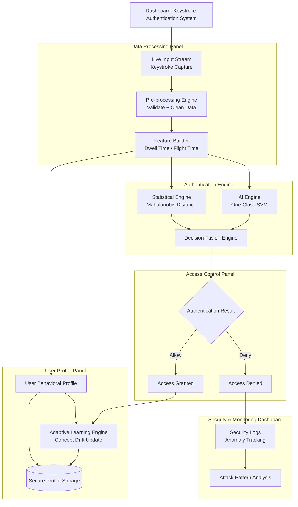

# Biometric Authentication System Login

[](https://github.com/bmarzky/keystroke-login)
[](https://www.python.org/)

**Biometric Authentication System Login** adalah sistem autentikasi berbasis *Keystroke Dynamics* yang memverifikasi identitas pengguna melalui pola ritme ketikan yang unik. Sistem ini dirancang sebagai lapisan keamanan kedua (**MFA**) yang menggabungkan analisis statistik multivariat dan *Machine Learning* untuk mendeteksi upaya impersonasi secara *real-time*, memastikan bahwa hanya pemilik akun asli yang dapat mengakses sistem meskipun password telah diketahui oleh pihak lain.

---

## Arsitektur Keamanan: Titanium Fusion Engine

Sistem ini menggunakan arsitektur berlapis untuk memastikan alur data yang aman dan terstruktur:



---

## Fitur Unggulan

| Komponen | Deskripsi Fungsional |
| :--- | :--- |
| **Adaptive Thresholding** | Pengerasan ambang batas keamanan secara dinamis berbasis populasi sampel ($n$). |
| **Replay Protection** | Deteksi redundansi data untuk menangkal serangan biometrik statis (*copy-paste*). |
| **Biometric Audit Trail** | Dokumentasi metrik teknis (Mahalanobis & AI Score) untuk kebutuhan forensik. |
| **AI Auto-Training** | Pelatihan model OCSVM secara otomatis setiap kelipatan 20 data baru. |
| **Forgiver Logic** | Toleransi cerdas terhadap deviasi kecepatan jika korelasi pola tetap tinggi. |
| **Multivariate Gating** | Analisis keterkaitan antar fitur menggunakan jarak Mahalanobis yang presisi. |
| **24D Feature Vector** | Ekstraksi 24 fitur unik termasuk FFT untuk identifikasi tanda tangan frekuensi. |
| **Secure Core** | Enkripsi sesi dan hashing password standar industri menggunakan Bcrypt. |

## Tech Stack

-   **Backend Core**: Python 3.12 (Flask Framework)
-   **Intelligence Unit**: Scikit-Learn (OCSVM), NumPy (Linear Algebra), Joblib
-   **Data Storage**: MySQL / MariaDB
-   **Security**: Bcrypt (Password Hashing), Session Encryption, .env Configuration
-   **Frontend**: HTML5, Vanilla CSS (Glassmorphism UI), Javascript (Keystroke Collector)

---

## Struktur Proyek

```text
keystroke-login/
├── app.py                     # Entry point: Flow autentikasi & Session management
├── requirements.txt           # Dependensi library (Flask, Sklearn, Numpy, etc.)
├── .env                       # Konfigurasi database & Secret keys
│
├── engine/                    # Inti Kecerdasan Biometrik
│   ├── core.py                # Titanium Fusion Engine (Logic Utama)
│   └── ml/                    # AI Environment
│       ├── ai_engine.py       # Inferensi OCSVM
│       ├── ai_trainer.py      # Background trainer model AI
│       └── models/            # Storage model *.joblib per user
│
├── logs/                      # Audit Trail (Forensik Biometrik)
│   ├── login_success.log      # Detil data biometrik yang diterima
│   └── login_failed.log       # Alasan penolakan (Speed, Mahal, or Score)
│
├── static/                    # Frontend Assets (Collector & UI)
├── templates/                 # Jinja2 Layouts (Auth & Dashboard)
└── scratch/                   # Tools Riset (Validation & Training scripts)
```

---

## Cara Instalasi

1.  **Persiapkan Database**: Jalankan MySQL (XAMPP), buat database `keystroke_db` dan impor skema yang disediakan di folder `database/`.
2.  **Virtual Environment (Opsional)**:
    ```powershell
    python -m venv venv
    .\venv\Scripts\activate
    ```
3.  **Install Dependencies**:
    ```powershell
    pip install -r requirements.txt
    ```
4.  **Konfigurasi `.env`**:
    Sesuaikan kredensial database di file `.env`.
5.  **Run Application**:
    ```powershell
    python app.py
    ```
    Akses di: `http://localhost:8000`

---

## Metrik yang Dianalisis

Sistem mengekstraksi 24 fitur unik dari setiap sesi login:
-   **Hold Time (Dwell)**: Durasi penekanan tombol.
-   **Flight Time**: Jeda antar penekanan tombol.
-   **D2D (Down-to-Down)**: Interval dari satu tombol ditekan ke tombol berikutnya.
-   **U2U (Up-to-Up)**: Interval dari satu tombol dilepas ke tombol berikutnya dilepas.
-   **Rhythm Ratio**: Keajegan ritme antar pasangan kunci.
-   **FFT (Fast Fourier Transform)**: Tanda tangan frekuensi dari pola ketikan untuk mendeteksi otomatisasi (bot).

---

<div align="center">

**Developed for Advanced Cybersecurity Research**  
*“In the world of Titanium Fusion, your password is no longer just what you know, but the unique rhythm of who you are.”*

[Report Bug](https://github.com/bmarzky/keystroke-login/issues) · [Request Feature](https://github.com/bmarzky/keystroke-login/issues)

</div>